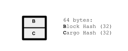
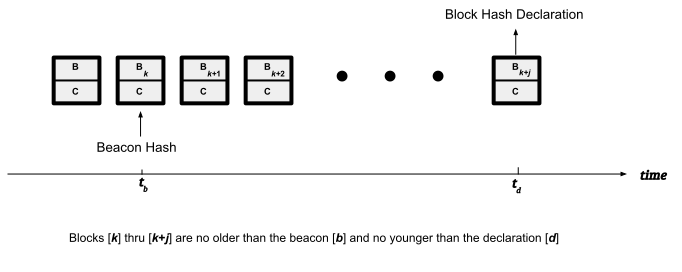
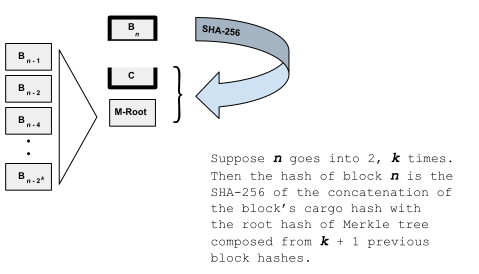
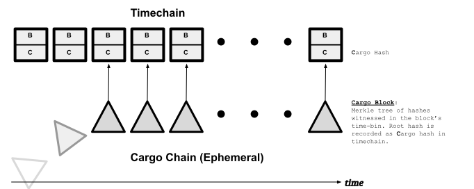

# Crums Timechain (Alpha)

A Crums timechain implements a *commitment protocol* for witnessing SHA-256 hashes.
The hashes witnessed can represent anything, of course: files, structured data, words --
it doesn't matter. The chain itself consists of a sequence of fixed-sized (64-byte)
time-blocks. Each block spans a fixed interval of time and records the hashes
witnessed in that interval. There are no gaps, so each block no. maps to a
representative UTC time since the chain's genesis block. The set of hashes
witnessed in each block is actually encoded as a *single* 32-byte value called the
*cargo hash*, which is usually (when multiple hashes are witnessed in the time
spanned by that block) the root hash of a Merkle tree.

|  | 
|:--:| 
| **Figure:** Timechain Block |

Additionally, each block "redundantly" records the hash of the block itself. The reason
why will soon become apparent, but for now, consider it as a form of memo-ization:
the hash of the block depends on its cargo hash, and that of every block before it.
Recording the block's hash this way does not obviate the need to verify the hash. Rather,
it will allow us to quickly construct a concise hash proof that a given cargo hash belongs at a
certain block no. in a given timechain. (But since our hash proofs are self verifying, every
time we construct one, the memo-ized block hashes are validated for consistency.)
     
## Block Hash Declaration = Commitment

Since the hash of the block numbered *n* depends on the contents of all previous blocks
(numbered *1* thru *n - 1*) in the chain, *declaring* the hash of block *n* amounts to
a commitment of the state of the chain (or *a* chain) at *n* blocks. The recipe for
calculating the *n*th block's hash (and how it supports constructing compact
hash proofs) is described in a later section. However, by themselves, block hashes won't
prove anything. A chain will need corroborating evidence to establish, within reasonable
margins, how old its blocks are. The exact mechanics of generating this corroborating
evidence (that the chain is honest about the rate and times it generates new blocks) will
be addressed in an upcoming release. It will work using a *network* of timechain servers
and a chain will package its corroborating evidence using what I'm tentatively calling
"declarations".

### What Makes A Declaration

Conceptually, a chain state declaration can be thought of as a *recording* of chain state
*at* (or *from*) one or more 3rd parties. These recordings come in 2 general forms: one is
designed to establishes how *old* a block is; the other, how *young* a block is. Collectively,
they will establish time bounds (minima and maxima) for when a timechain's blocks were
generated.

(But note that everytime a new witness receipt is created, the receipt
also embeds the state of the chain up to the block no. it occurs in.
So a chain's state is always being implicitly declared to its active users.
And its active users can see in real time the chain's block evolution.
What concerns us here is a verifiable, digital, *historical* record, not just active users
telling on a timechain.)

#### How Old (Minimum Age)

Timechains package hash proofs of their witnessing hashes in a structure called a *crumtrail*
(described in a later section). It asserts the overall structure of the chain, as well as
the block no. in which the hash was witnessed. By periodically having its chain state (the hash
of a recent block) witnessed on one or more other timechains (recorded as crumtrails) a chain will be
able to establish its bona fides about the *minimum age* of its blocks.

Alternatively, the declaration may be bootstrapped at some other trusted, timestamped
location. Examples range from posting the chain's hash to social media (if you trust the whims of
their present and future owners), commiting the chain's [latest block] hash to a GitHub repo,
or even to the Bitcoin blockchain.

|  | 
|:--:| 
| **Figure:** Timechain Declarations:*beacon*s guarantee a maximum block age; *crumtrail*s assert minimum age.  |

#### How Young (Maximum Age)

Conversely, if a block in a timechain is witness to a *beacon-hash*, then a hash proof (crumtrail)
asserting so establishes that that block and every subsequent one after it is no older than the beacon
hash. Here, a beacon hash is a value that couldn't have been calculated in advance. Examples include
the [NIST Randomness Beacons](https://csrc.nist.gov/Projects/interoperable-randomness-beacons/beacon-20).
Since a public timechain's latest block hash is essentially random (the more users it has, the more
so), it should be possible to construct randomness beacons (much like the NIST reference) from
a collection of timechains. (If at least one timechain operator in the collection is honest, then
it will be a good beacon.)

### TBD Topics

A variety factors will influence the design of "declarations". One thing to note is that while crumtrails
are small, self-contained, and quick-to-verify, it may be acceptable if a chain's corpus of "declarations"
is not so compact. For example, it may be possible to compute a perhaps computationally
expensive score for a chain's trustworthiness generally. Opt-in discovery protocols,
automation, beacon construction, and supporting proof structures.. these are topics worth addressing
*after* (and *if*) a community of timechain operators develops.

## Block Hash Calculation

In most blockchain designs, each block is linked to its predecessor via a special cell
designated for recording the hash of the previous block. Its linked structure resembles a singly
linked list, except here, instead of pointers into memory, we have hash pointers -- pointers to
value, if you will. A Crums timechain also employs hash pointers. However, its blocks do not
reserve any special cells for recording the hashes of the predecessor blocks they reference.
Rather, a block's hash pointers to previous blocks are *implicitly manifest* in how the block's
hash is calculated. A key differentiator with timechains is that they model not just
singly linked lists, but also a multiply linked structure resembling a skip list, which we call
a *skip ledger*.

|  | 
|:--:| 
| **Figure:** The block's hash is the SHA-256 of the concatenation of its cargo hash with the Merkle root of the block's hashpointers to previous blocks. |

The number of (implicit) hash pointers in a block is uniquely determined by its block no. *n*.
(Unlike the skip list search structure, linkage is not probabilitstic.) Block no.s start from 1,
and if 2*k* is largest power of 2 that divides *n*, then there are
*k* + 1 hash pointers in block *n* referencing blocks
*n*-1, *n*-2, *n*-4, *n*-8, .. , *n*-2*k*.
On average each block only references 2 previous blocks. Thus, again on average, a block's hash
can be derived from 3 SHA-256 hashes: the cargo hash, and the hash of 2 previous blocks.

The point behind calculating block hashes this way is that it allows us to construct concise
hash proofs linking any high block no. to a lower block no.: there is a shortest (hash proof)
path that scales with the logarithm of the difference of their block no.s. For example,
a hash proof linking block [534] to the genisis block [1] need only contain information about
(constructing hashes for) the following block no.s:

>   [1, 2, 4, 8, 16, 32, 64, 128, 256, 512, 528, 532, 534]

More precisely, the byte size of such proofs scale as

>   **O(** log(log(*n*)) x log(*n*) **)**

where *n* is the no. of blocks. However for all intents and purposes *log log n* can be
treated as constant.

This property, in turn, allows timechains to efficiently declare not just their latest block-hash,
but also their provenance, in terms of a hash proof from the genesis block to the latest block.
These are called [block] *state proof*s. An important property of state proofs is that
newer state proofs can be independently verified (offchain) that they share common lineage with
older state proofs from the same chain.

More generally, the shortest (minimum) hash-proof path connecting a set of block no.s is called
a [block] *skip path* (for those block no.s). An important property of skip paths is
that any other (longer) hash proof linking those blocks together must necessarily include the
block no.s already in the skip path (i.e. they cannot be skipped over in a hash proof connecting
the blocks in the set).

### Sentinel: Block Zero

Block no.s start at 1. Technically, every chain also has an abstract zero'th block, called the
sentinel block. The hash of block-zero is identically defined as a string of zero bits, 32-bytes
wide. The chain's blocks connect to the sentinel block at a maximum of 63 levels (it is first linked
from blocks 1, 2, 4, 8, and so on); its cargo hash is undefined. The exact choice of value for the
sentinel block's hash value (all zeroes) may seem somewhat arbitrary. However, it's part of the
protocol: its zeroed bytes model how the protocol counts blocks in the chain and how that count
is verified in the chain's block proofs.

## The Cargo Chain

A Crums timechain is supported by a background service (called a *notary* in the codebase)
that uses an emphemeral background structure called the *cargo chain*. Each of its blocks
(called a *cargo block*) is related to a unique timechain block and collects the hashes witnessed
in that block. Once the cargo block is ready to be committed to the timechain, a Merkle tree is
built from the hashes witnessed and the tree's root hash is committed (recorded) as the *cargo hash*
of corresponding timechain block.

|   |
|:--:| 
| **Figure:**  The ephemeral blocks in the cargo chain can be imagined to fall off a conveyor belt |

A *cargo block* doesn't exist forever: it's supposed to last at least as long as the timechain's
advertised block-retention policy. When a user first submits a SHA-256 to be witnessed, they
receive a receipt in the form of a *crum*, which is a tuple pairing the 32-byte hash,
with an 8-byte UTC signifying the witness time. The crum is recorded in the cargo block associated
with its witness time. (The block no. can be inferred from the crum's witness time.) 
Seconds later (or minutes, depending on the timechain's block-granularity) when the
block-time has elapsed by a safe margin, the crums collected in the cargo block are built into a
Merkle tree, and its root hash is committed as the cargo hash in the timechain block at the same
block no. From here on out, while the cargo block still exists, a user can retrieve a persistent
hash proof asserting the crum's membership in the timechain block it belongs in.

## Crumtrails (Witness Proofs)

A *crumtrail* is a hash proof asserting a hash was witnessed by a timechain. It is composed
of a crum along with two hash proofs:

1. **Cargo Proof.** A Merkle proof asserting a Merkle tree's root hash with the SHA-256 of a crum
(its 40-byte representation) as one of its leafs (members). This root hash is understood to be the
*cargo hash* of a timechain block. The timechain's block no. is inferred from the crum's UTC field.
2. **Block Proof.** A *skip path* in a timechain that includes the block no. inferred above and
whose cargo hash at that block no. matches the root hash in the Merkle proof above.

When a crumtrail is first retrieved from the [notary] service, its block no. (the block no. it was
witnessed in) lies near the tail (end) of the timechain. As time elapses and the timechain accumulates
new blocks, the  crumtrail's block proof can be updated to include (link to) later timechain blocks.
The service dispenses block proofs linking any set of (existing) timechain block no.s on demand.
But note, block proofs in crumtrails from the same timechain share a good deal of common block
information. As a result, when archived together, the block proofs of older crumtrails can often be
extended to those used in the newer crumtrails.

## Chain Parameters

A timechain's block resolution and its block boundaries (the time one block begins and another ends)
are *fixed at inception*. Depending on use, different resolutions may be appropriate.

### Bin Exponent

Recall a timechain is composed of a contiguous sequence of equal-duration blocks. The duration of
each of its blocks in milliseconds is expressed as a power of 2, called the bin exponent. That is,
if the bin exponent is *e*, then the duration of each block is 2e milliseconds. Presently,
the bin exponent can be no less than 8 (quarter sec + 6 millis) and no greater than 26 (about 18h:38m).
      

The bin exponent *e* also models bin boundaries (i.e. where blocks begin and end). A block's UTC start time
(in milliseconds) begins at a value with its *e*- rightmost bits set to 0 and ends at a UTC value with
the same left-side bits as in the start time, but with its *e*- rightmost bits set to 1.

### Inception UTC

The genesis block is numbered 1 (not zero). The chain's inception UTC is the smallest (first) UTC value
that falls in the genesis block.

## Chain Dynamics

A brief overview of the maintenance of timechains, adverserial strategies and/or dynamics,
and the characteristics of the truth model employed follows.

### Adverserial Actors ###

Since a timechain is little more than an ordered sequence of opaque hashes (more opaque than its
witnessed inputs) there's little opportunity for a malicious *user* to manipulate chain state to
their advantage. The only adverserial play in this space concerns time itself (how a timechain's
block no.s map to UTC time), and that play is only available to timechain operators.

For example, a chain owner might claim (without evidence of course), the fake timechain they just
generated was actually genenerated over the course of months of use.

### Truth Model

The only "Truth" timechains concern themselves with is time itself. While the evolution of a timechain is
driven by its users, its operation is neither decentralized, nor consensus-driven. To the degree feasible,
we will try to avoid leaning on consensual mechanisms for establishing time: the aim is to allow users
of private timechains still be able to prove the age of things to the world at large.
      
Instead of purely by concensus, the accuracy (or inaccuracy) of how a timechain's block no.s map to
real UTC times will be determined by *factuals* (or counter-factuals). As mentioned before, an example of
a factual is a block being witness to a beacon hash that is somehow known to be no older than a certain
date. One way to generate such a beacon hash is to source it from the hash state of a collection of other
timechains: if at least one of the timechains is an honest actor, then it'll be a good beacon.
Conversely, a timechain may periodically record it's own state (hash) on a collection of other chains
in order to establish its blocks are no younger than a certain date.

### On Forking

With only 64 bytes per block, a timechain itself is a compact file. While the REST API does not
expose the file directly, the chain can be copied and forked. The chain file is the timechain owner's
property and they can probably stipulate conditions on how it can (or cannot) be used. From an operational standpoint, however, it doesn't matter if a chain is forked. Indeed, forking may be seen
as complimentary mimicry: it only solidifies the existing history of a chain. Further, the system 
will work better the more timechain servers are running on the open web, so forking,
condoned or not, is not counterproductive.

### On Signing

I'm a bit ambivalent about signing. I don't think timechains should sign their data: their REST API
endpoints are sufficiently identifying (especially, if exposed over HTTPS). There is
nothing wrong with building a brand around a timechain in terms of quality of service, trustworthiness,
etc. But the *trust-but-verify* maxim should still be operative, no matter whose timechain it is.

## Scaling

The service uses the file system directly as its data store (a directory). It is designed so that
multiple instances of the service can concurrently run against the same directory: e.g. a network mount
point shared across multiple VMs. This property in turn helps with keeping the service durable and
makes it possible to scale up (down) with user load by spinning up (down) new instances.
      
Each instance of the service supports multiple concurrent readers and writers.
Processing is I/O bound: by the file system, and by the network layer.
Presently, the HTTP implementation leans on the new Java virtual threads, which effectively
delivers non-blocking handling at both the file and network layers.
With regard to file I/O, there are a number of caching opportunities
future versions will take advantage of. The Alpha version does not cache any data: its only
source of data is the file system.

